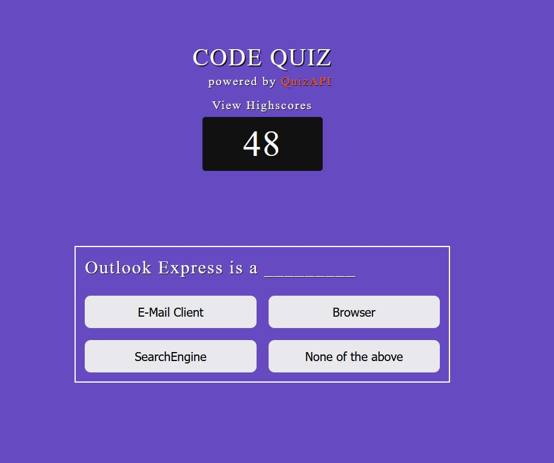
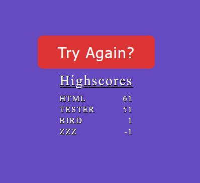

# Code Quiz

## Links
- Live Site URL: [live site](https://jon-ledo.github.io/Coding-Knowledge-Quiz__QuizAPI/)
- Repo: [repo](https://github.com/Jon-Ledo/Coding-Knowledge-Quiz__QuizAPI)

## Tech Used
- HTML
- CSS
- JavaScript
- API [link to QuizAPI](https://quizapi.io/)

## Description
A timed coding quiz with multiple-choice questions. 
This app runs in the browser and features dynamically updated HTML and CSS powered by JavaScript.

## Preview

## Usage
When page is loaded up, a fetch request is made to the [quizAPI link](https://quizapi.io/) and a query is made with a free API key, and the parameters 
- limit: 10,
- difficulty: 'Easy',
- tags: 'html'

are used to generate the questions for the app. 

User clicks on the Start Quiz button to begin a timed quiz game. 

User anwsers questions by clicking on the buttons. 
If correct, 4 seconds is added onto the timer above, else 4 seconds is deducted. 

At the end of the quiz, final score is determined by the time remaining and saved to LocalStorage. The user may view their high scores at any time by  clicking the 'view highscores' text. 

Furthermore, when the page is loaded, or the quiz is restarted, the saved scores are grabbed from localStorage and saved into an array, and sorted to be used in the app. 

## Credits
- The quizAPI for the set of predetermined questions
- [link to QuizAPI](https://quizapi.io/)
